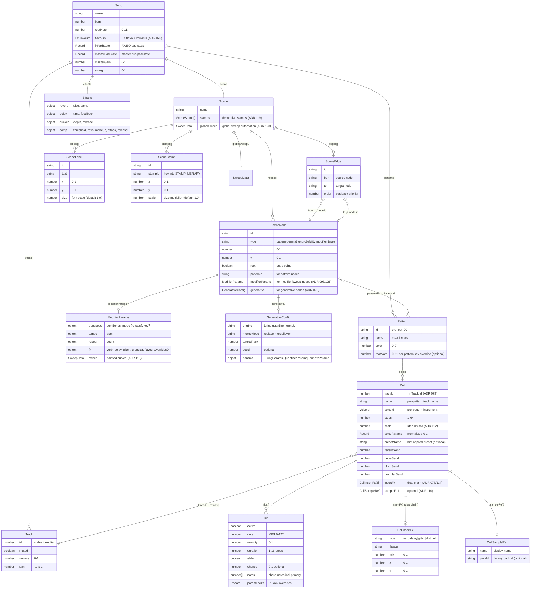
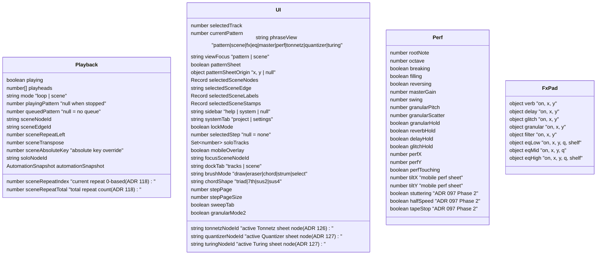

# Data Model

## Song Structure

## Key Conventions

| Convention | Detail |
|---|---|
| **Track lookup** | `cellForTrack(pat, trackId)` not `cells[index]` (ADR 079) |
| **Parameters** | Normalized 0.0–1.0 on UI side; denormalized in DSP |
| **Undo** | Snapshot-based — `pushUndo(label)` before mutations |
| **Deep copy** | `clonePattern()` — `structuredClone` fails on Svelte proxies |
| **Two cursors** | `ui.currentPattern` (user) vs `playback.playingPattern` (scene) |
| **Sample key** | `"${trackId}_${patternIndex}"` — per-cell sample cache |
| **tracks[]** | Append-only (never spliced), indices are stable |
| **Node types** | `pattern`, `generative`, `probability`, modifier: `transpose`, `tempo`, `repeat`, `fx`, `sweep` |

## Runtime State (non-persisted)

