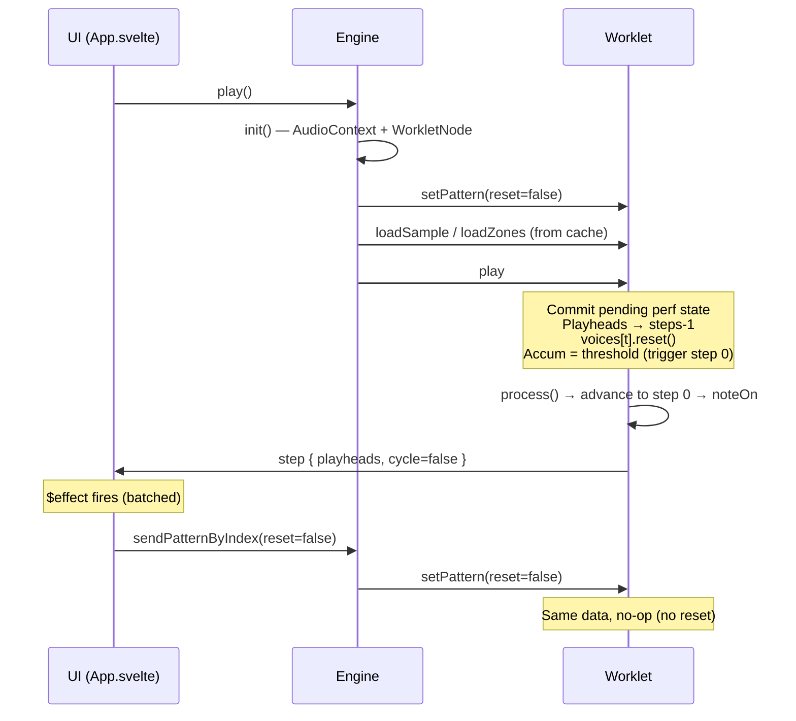
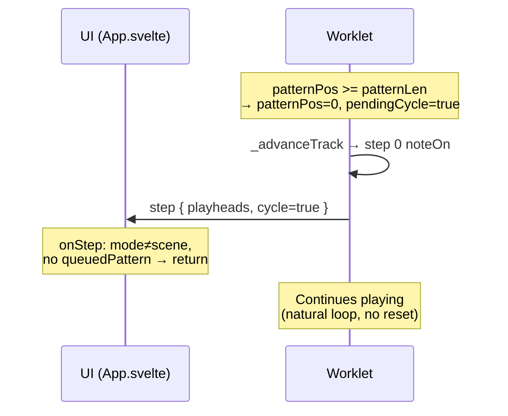
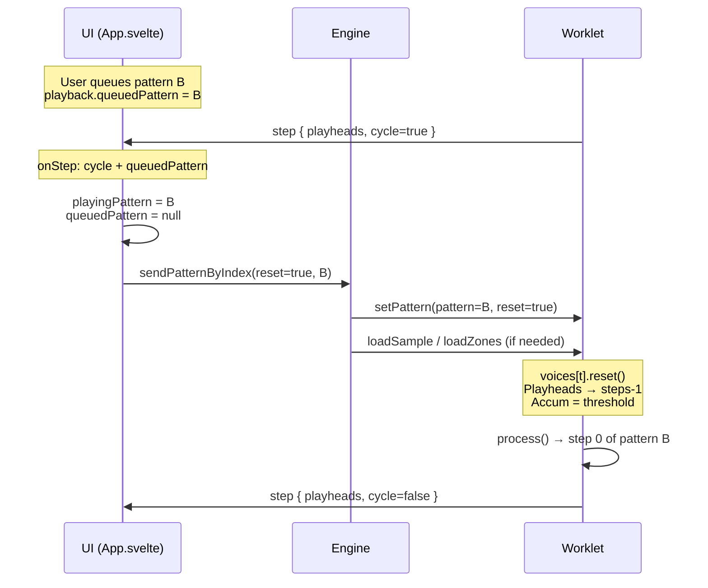
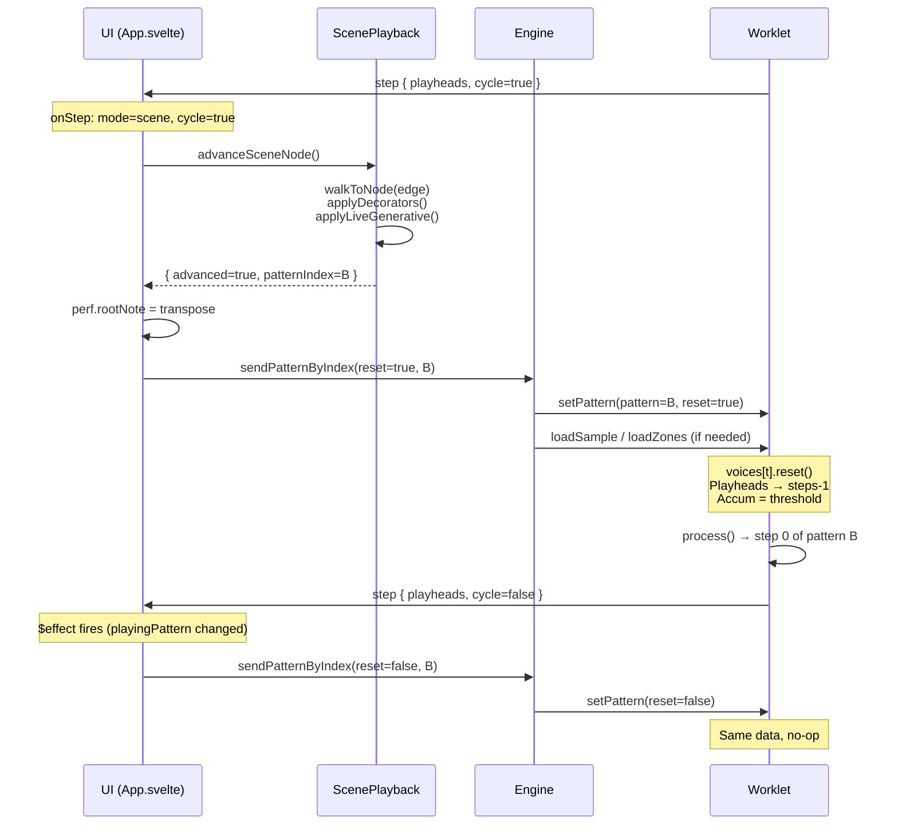
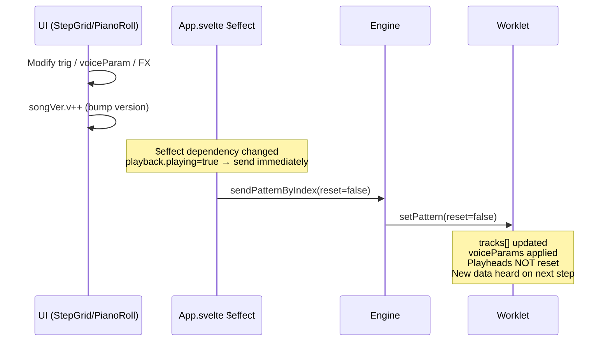
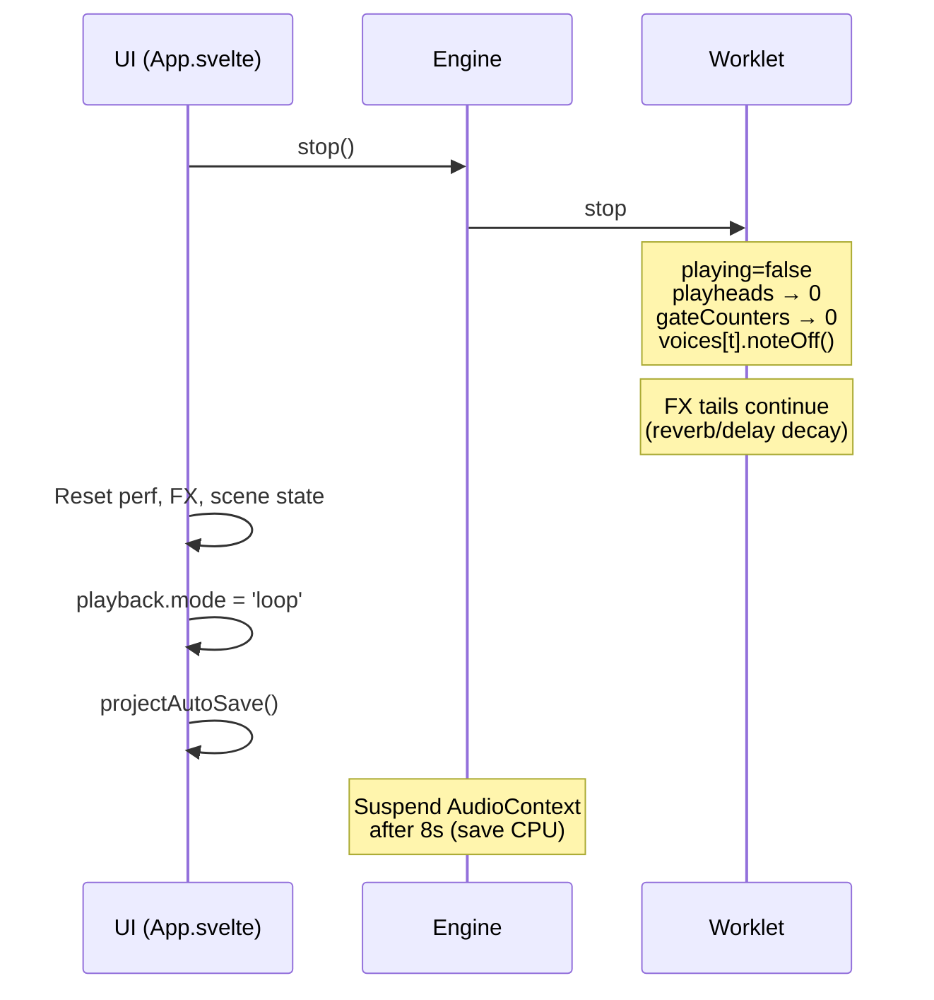

# Worklet Message Flow

UI (main thread) ↔ AudioWorklet (audio thread) communication.

## Message Types

### UI → Worklet (WorkletCommand)

| type | key params | when sent |
|---|---|---|
| `play` | — | User presses play |
| `stop` | — | User presses stop |
| `setBpm` | `bpm` | BPM changed during playback |
| `setPattern` | `pattern`, `reset?` | Pattern sync (edit/switch) |
| `triggerNote` | `trackId`, `note`, `velocity` | Keyboard/UI audition |
| `releaseNote` | `trackId` | Key up |
| `releaseNoteByPitch` | `trackId`, `note` | Poly key up |
| `loadSample` | `trackId`, `buffer` (transfer), `sampleRate` | Sample cache hit |
| `loadZones` | `trackId`, `zones[]` | Pack zones cache hit |

### Worklet → UI (WorkletEvent)

| type | data | frequency |
|---|---|---|
| `step` | `playheads[]`, `cycle` | Every track step advance |
| `levels` | `peakL`, `peakR`, `gr`, `cpu` | ~60 fps (meter interval) |

## Sequence: Initial Play



## Sequence: Loop Cycle (no queue)



## Sequence: Loop Cycle (queued pattern switch)



## Sequence: Scene Cycle (pattern switch)



## Sequence: Live Edit During Playback



## Sequence: Stop



## Timing: Cycle Boundary Gap

```
┌──────────────────────────────────────────────────────────────────┐
│ Worklet process() N                                              │
│  patternPos >= patternLen → pendingCycle = true                  │
│  _advanceTrack → step 0 noteOn (OLD pattern data)               │
│  postMessage({ step, cycle: true })                              │
├──────────────────────────────────────────────────────────────────┤
│ Worklet process() N+1, N+2  (2.7ms each @ 48kHz)                │
│  Tracks continue advancing with OLD data                         │
│  (gap: waiting for UI to respond)                                │
├──────────────────────────────────────────────────────────────────┤
│ Main thread receives step event                                  │
│  advanceSceneNode() → resolve next pattern                       │
│  sendPatternByIndex(reset=true, newPattern)                      │
├──────────────────────────────────────────────────────────────────┤
│ Worklet receives setPattern(reset=true)                          │
│  voices[t].reset() — silence old notes                           │
│  Playheads → steps-1, accum = threshold                          │
├──────────────────────────────────────────────────────────────────┤
│ Worklet process() N+K                                            │
│  step 0 of NEW pattern fires cleanly                             │
└──────────────────────────────────────────────────────────────────┘

Round-trip latency: ~3–10ms (1–3 process() calls)
During this gap, OLD pattern step 0+ plays briefly before reset.
```

## Pattern Sync: $effect vs Direct Send

| Source | reset | When |
|---|---|---|
| `$effect` (line 81) | `false` | Any reactive state change (songVer, perf, fxPad, etc.) |
| `play()` (line 228/233) | `false` | Initial play — paired with `engine.play()` |
| `onStep` cycle (line 179/190) | `true` | Pattern switch at cycle boundary |
| Solo node (line 167) | `true` | Solo target reached at cycle |

**Rule**: `reset=true` rewinds playheads and retriggers step 0. `reset=false` hot-swaps data mid-playback.

## Worklet Internal: Pending State

Performance parameters are NOT applied immediately — they are committed at step boundaries to prevent mid-note changes:

| Pending Field | Committed When |
|---|---|
| `pendingRootNote` | `play` handler OR every 1/16 boundary (patternPos even) |
| `pendingBreaking` | Same |
| `pendingFilling` | Same |
| `pendingReversing` | Same |
| `pendingOctave` | `setPattern(reset=true)` only |
