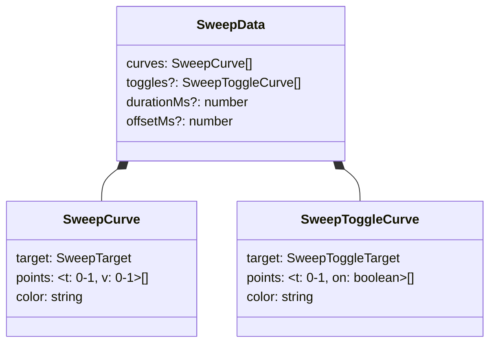
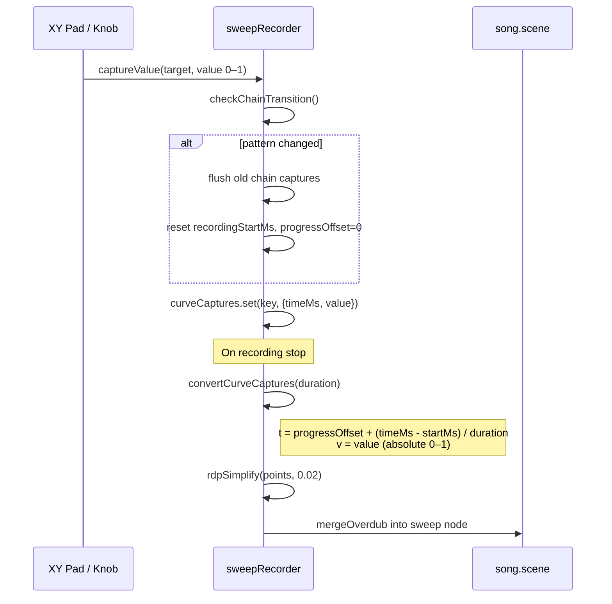
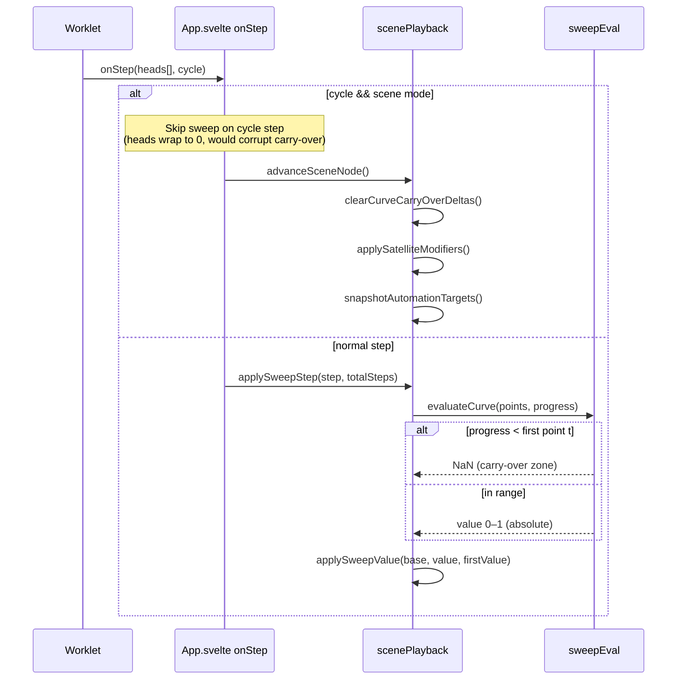
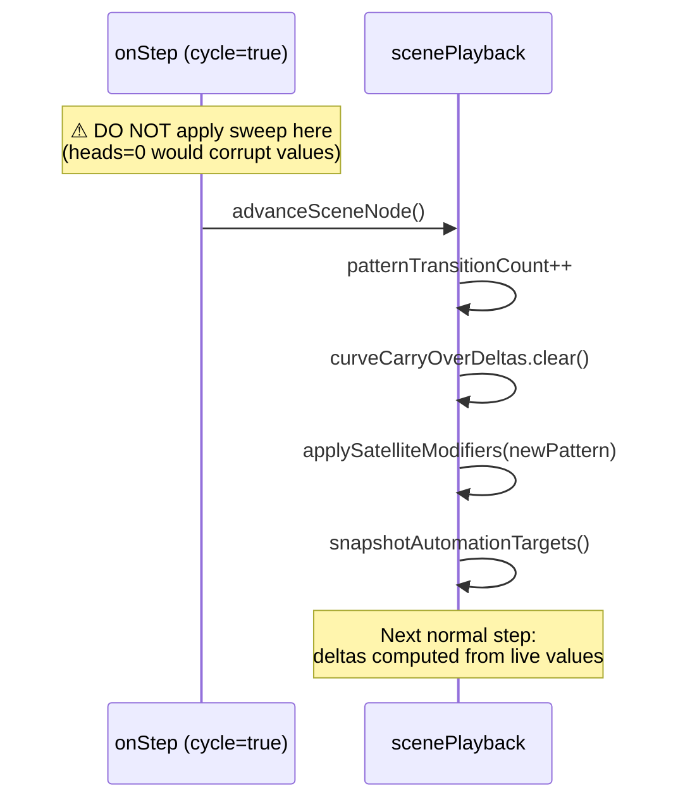
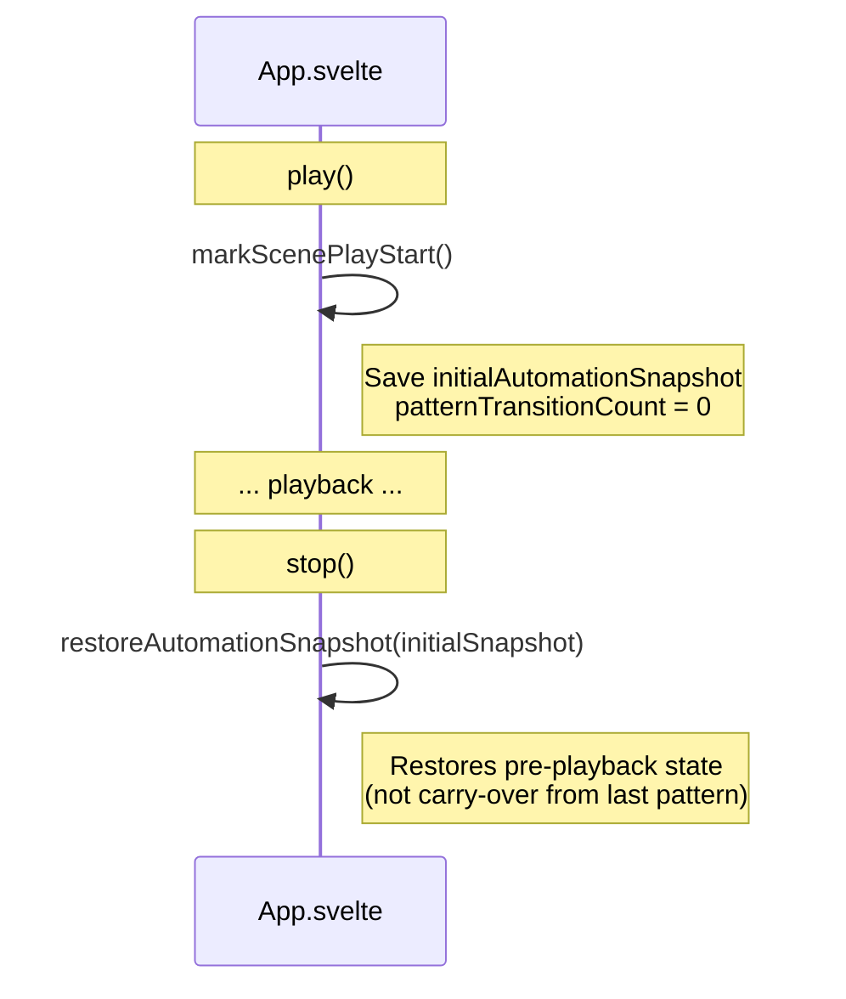

# Sweep Automation

Recording, storage, and playback of continuous parameter automation (ADR 118, 123).

## Data Model



Curve values are **absolute normalized (0–1)**. Denormalized to native range on playback:

| Target kind | Param examples | Native range | Denorm formula |
|---|---|---|---|
| `fx` | reverbWet, delayTime | 0–1 | `v` (direct) |
| `master` | masterVolume, swing, compThreshold | 0–1 | `v` (direct) |
| `track:volume` | — | 0–1 | `v` (direct) |
| `track:pan` | — | -1..+1 | `v * 2 - 1` |
| `track:voiceParam` | cutoff, decay | min..max | `min + v * range` |
| `send` | reverbSend, delaySend | 0–1 | `v` (direct) |
| `eq:freq/gain` | — | 0–1 | `v` (direct) |
| `eq:q` | — | 0.3–8.0 | `0.3 + v * 7.7` |

## Recording Flow



Key points:
- `captureValue` receives 0–1 normalized values from all UI controls
- Chain transition detection is synchronous (inside `captureValue`)
- Each pattern's sweep is stored on its own sweep modifier node
- Points are simplified with Ramer-Douglas-Peucker (epsilon=0.02)

## Playback Flow



### Progress Calculation

```
progress = (sceneRepeatIndex + step / totalSteps) / sceneRepeatTotal
```

With rep=2 and 16 steps: progress spans 0.0–1.0 across both reps.

### Carry-Over Delta (per-curve, per-pattern)

At each curve's first evaluation in a new pattern, a delta is computed:

```
delta = liveParamValue − denorm(firstPointValue)
result = denorm(curveValue) + delta
```

| Scenario | delta | Effect |
|---|---|---|
| First pattern in scene | 0 (forced) | Absolute values applied directly |
| Continuous recording | ≈ 0 | Values match at boundary, no jump |
| Separately recorded | ≠ 0 | Bridges gap smoothly from carry-over |

Deltas are cached in `curveCarryOverDeltas` (Map) and cleared on each pattern transition.

## Pattern Transition (Critical Ordering)



The cycle step skip is essential — without it, the worklet's wrapped-around `heads[]=0` causes sweep evaluation at progress ≈ 0.5 (for rep=2), overwriting the carry-over values.

## Stop → Play Reset



Using the initial snapshot (not the per-pattern carry-over snapshot) ensures FX on/off and parameter values don't leak across play sessions.

## Send Parameters

Send params (reverbSend, delaySend, etc.) are stored **per cell**, not globally. When patterns change, the cell changes too. Carry-over does not apply — each pattern's send starts from its own cell's value.

## Legacy Migration

Old saves stored offset values (`v = value * 2 - 1`, range -1..+1). On load, `migrateSweepCurvesToAbsolute()` in `restoreScene` converts to absolute: `v = (v + 1) / 2`. Detection: any point with `v < -0.001 || v > 1.001`.
